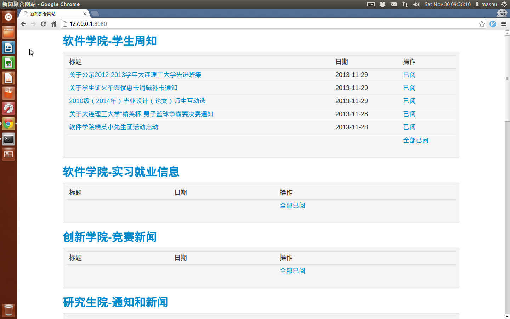

News hub of SSDUT
===============

## Requirements
```
sudo easy_install requests
sudo easy_install beautifulsoup
sudo easy_install redis
sudo easy_install apscheduler
sudo apt-get install redis-server
```

## Usage
### run the script
```
python info.py &
```
### visit the site
open `http://127.0.0.1:8080` in an incognito window of Chrome(Ctrl+Shift+N)  
Read the news you are interested, and click '已阅' or '全部已阅' to filter news.  
The screen capture:  

